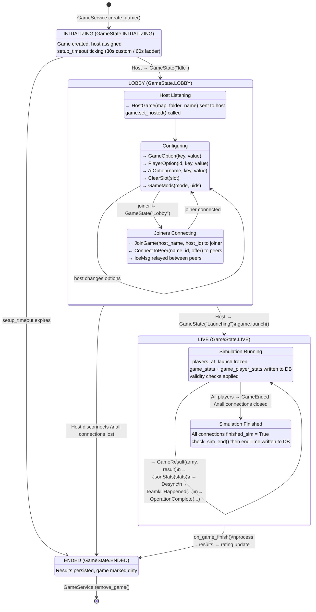
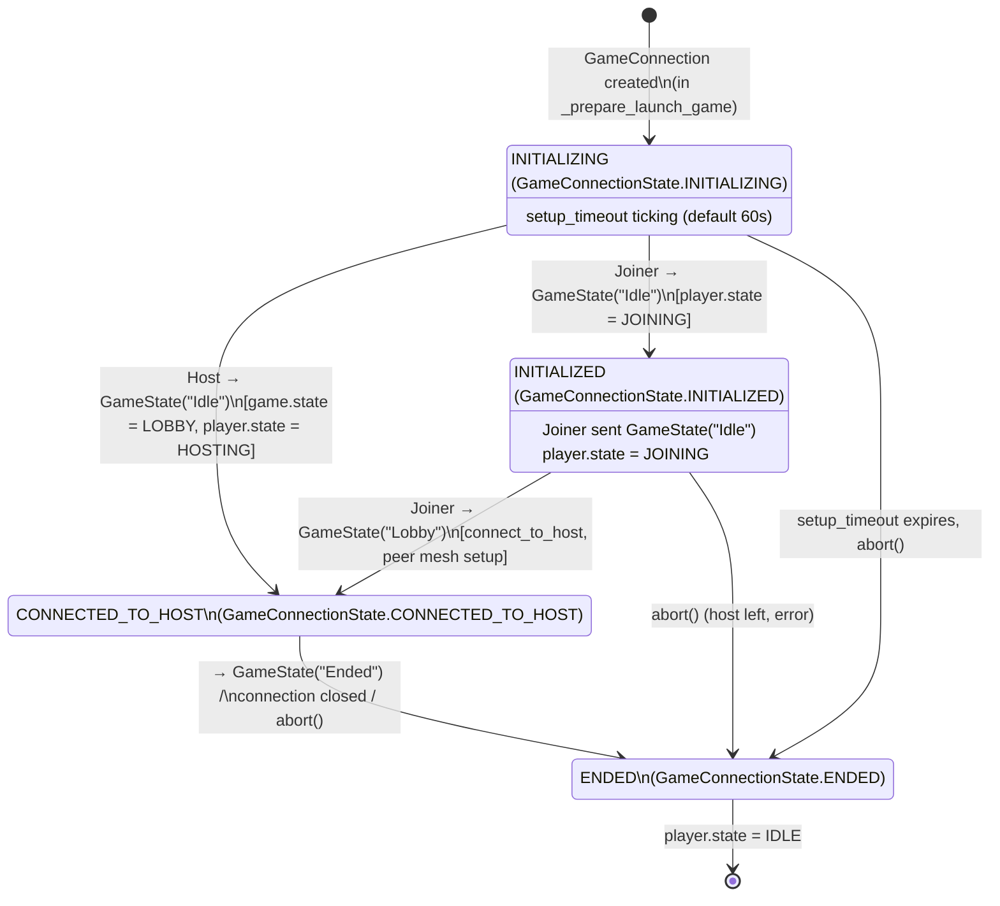
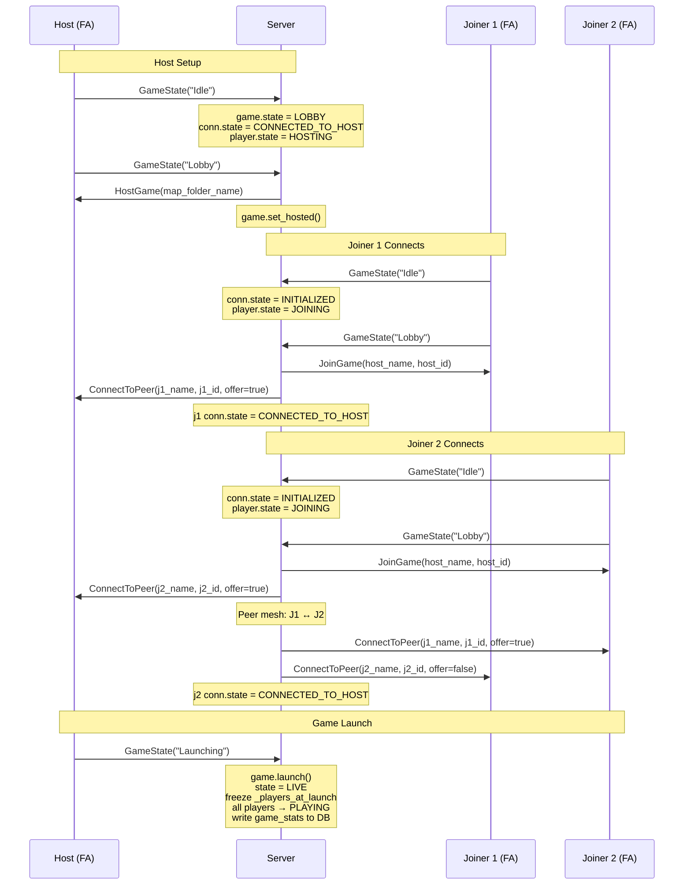
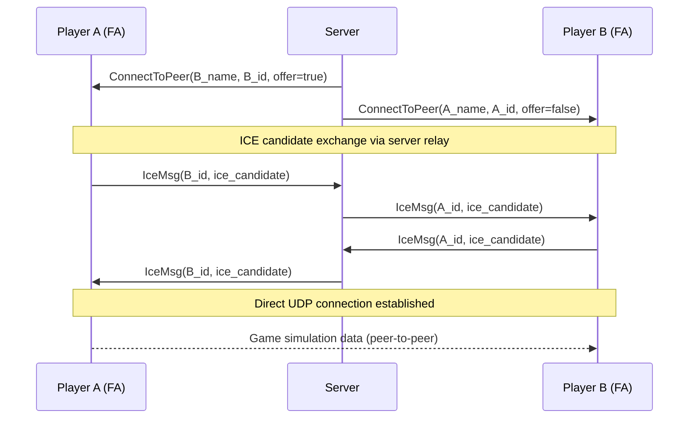
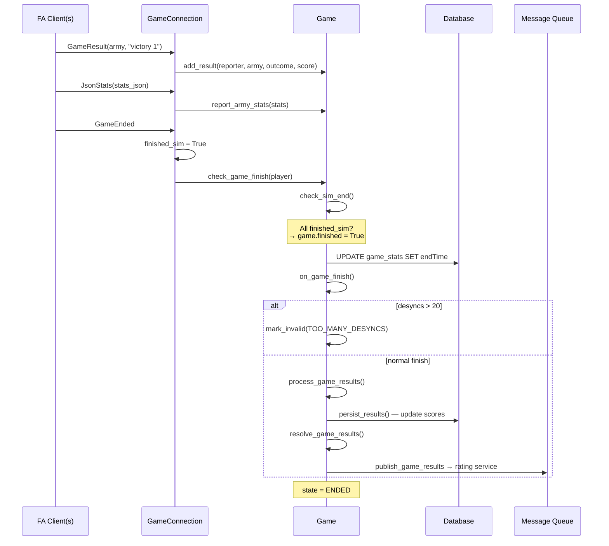

# FA Game Instance State Machine

This diagram documents the **game instance lifecycle** from the **server's perspective**, showing how GPGNet commands drive state transitions inside a `Game` object. States correspond to the `GameState` and `GameConnectionState` enums tracked server-side.

For the player/client lifecycle (PlayerState transitions driven by lobby messages), see [state-machine.md](state-machine.md).
For the full message schema, see [v1/asyncapi.yml](v1/asyncapi.yml).

## Game State Machine

## GameConnectionState Machine

Each player's connection to a game is tracked independently. The host and joiners follow different paths through these states.

## Lobby Phase — GPGNet Handshake

This sequence shows the full GPGNet command flow during lobby setup for a host with two joiners. The `offer` parameter on `ConnectToPeer` determines ICE initiator (`true`) vs responder (`false`).

## ICE / Peer-to-Peer Connection Flow

All game traffic flows peer-to-peer over UDP. The server only relays ICE signaling messages to establish the direct connection.

## Game End Flow

## GPGNet Command Reference

### FA → Server (game client sends)

| Command | Parameters | Phase | Description |
|---|---|---|---|
| `GameState` | `state` ("Idle", "Lobby", "Launching", "Ended") | All | Drives game and connection state transitions |
| `GameOption` | `key, value` | LOBBY | Host sets game option (Victory, Cheats, Speed, etc.) |
| `PlayerOption` | `player_id, key, value` | LOBBY | Host sets player option (Faction, Team, Color, StartSpot, Army) |
| `AIOption` | `ai_name, key, value` | LOBBY | Host configures AI player |
| `ClearSlot` | `slot` | LOBBY | Host removes player/AI from slot |
| `GameMods` | `mode, args` | LOBBY | Report activated mods ("activated" count or "uids" list) |
| `EnforceRating` | _(none)_ | LOBBY | Host requests rating enforcement |
| `GameFull` | _(none)_ | LOBBY | All slots filled (informational) |
| `Chat` | `message` | LOBBY | In-lobby chat message |
| `LaunchStatus` | `status` | LOBBY | "Rejected" if matchmaker launch failed |
| `GameResult` | `army, result_string` | LIVE | Army outcome (e.g. "victory 1", "defeat 0") |
| `GameEnded` | _(none)_ | LIVE | Simulation has ended for this player |
| `JsonStats` | `stats_json` | LIVE | Army statistics JSON blob |
| `OperationComplete` | `primary, secondary, time_delta` | LIVE | Coop mission completion |
| `Desync` | _(none)_ | LIVE | Desync event (>20 → game invalid) |
| `TeamkillHappened` | `gametime, victim_id, victim_name, tk_id, tk_name` | LIVE | Automatic teamkill report |
| `TeamkillReport` | `gametime, reporter_id, reporter_name, tk_id, tk_name` | LIVE | Player-initiated teamkill report |
| `IceMsg` | `receiver_id, ice_msg_json` | LOBBY/LIVE | ICE candidate relay for P2P setup |
| `Bottleneck` | `code, ...args` | LIVE | Player data processing bottleneck |
| `BottleneckCleared` | _(none)_ | LIVE | Bottleneck resolved |
| `Disconnected` | `...args` | LIVE | Peer disconnected (logged only) |
| `Rehost` | `...args` | LOBBY | Game rehosted (unused) |

### Server → FA (server sends to game client)

| Command | Parameters | When Sent | Description |
|---|---|---|---|
| `HostGame` | `map_path` | Host sends GameState("Lobby") | Tell host FA to start listening for peer connections |
| `JoinGame` | `player_name, player_uid` | Joiner sends GameState("Lobby") | Tell joiner FA to connect to host |
| `ConnectToPeer` | `player_name, player_uid, offer` | Joiner enters lobby | Establish peer mesh; `offer=true` = ICE initiator |
| `DisconnectFromPeer` | `player_id` | Peer leaves during LOBBY | Tell FA to disconnect from a specific peer |
| `IceMsg` | `sender_id, ice_msg_json` | During ICE negotiation | Relayed ICE candidate from another peer |

## Game Type Variants

| Property | Custom | Coop | Matchmaker |
|---|---|---|---|
| **Class** | `CustomGame` | `CoopGame` | `LadderGame` |
| **InitMode** | `NORMAL_LOBBY` | `NORMAL_LOBBY` | `AUTO_LOBBY` |
| **GameType** | `custom` | `coop` | `matchmaker` |
| **Rating** | `global` | not ranked | from queue config |
| **Setup timeout** | 30s | 30s | 60s |
| **Lobby config** | Host configures | Host configures | Server pre-sets (faction, team, slot) |
| **Launch** | Host clicks launch | Host clicks launch | Server waits for `wait_hosted` + `wait_launched` |
| **Special** | — | `OperationComplete` for coop leaderboard | `LaunchStatus("Rejected")` on settings mismatch |

## State Reference

| GameState | Value | Description | Entry Trigger |
|---|---|---|---|
| `INITIALIZING` | 0 | Game created, awaiting host's first GPGNet message | `GameService.create_game()` |
| `LOBBY` | 1 | Host listening, players joining and configuring | Host sends `GameState("Idle")` |
| `LIVE` | 2 | Simulation running, results being collected | Host sends `GameState("Launching")` → `game.launch()` |
| `ENDED` | 3 | Game finished, results processed | `on_game_finish()` |

| GameConnectionState | Value | Description | Entry Trigger |
|---|---|---|---|
| `INITIALIZING` | 0 | GameConnection created, FA process starting | `_prepare_launch_game()` |
| `INITIALIZED` | 1 | Joiner sent `GameState("Idle")`, not yet connected to host | Joiner: `_handle_idle_state()` |
| `CONNECTED_TO_HOST` | 2 | Peer setup complete, in the game | Host: `_handle_idle_state()` / Joiner: `_handle_lobby_state()` |
| `ENDED` | 3 | Connection terminated, player returned to IDLE | `abort()` / `on_connection_closed()` |

## Message Legend

| Arrow | Meaning |
|---|---|
| `→ message` | Game client (FA) sends GPGNet command to server |
| `← message` | Server sends GPGNet command to game client (FA) |
| `→ lobby_command` | Client sends lobby protocol message to server |
| `← lobby_message` | Server sends lobby protocol message to client |
