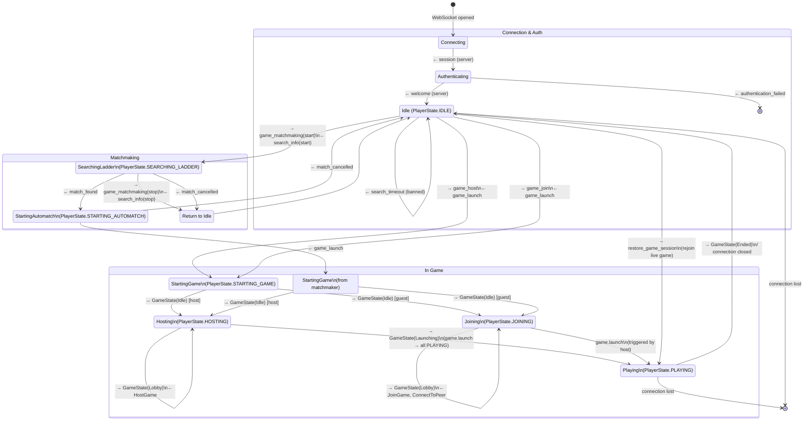
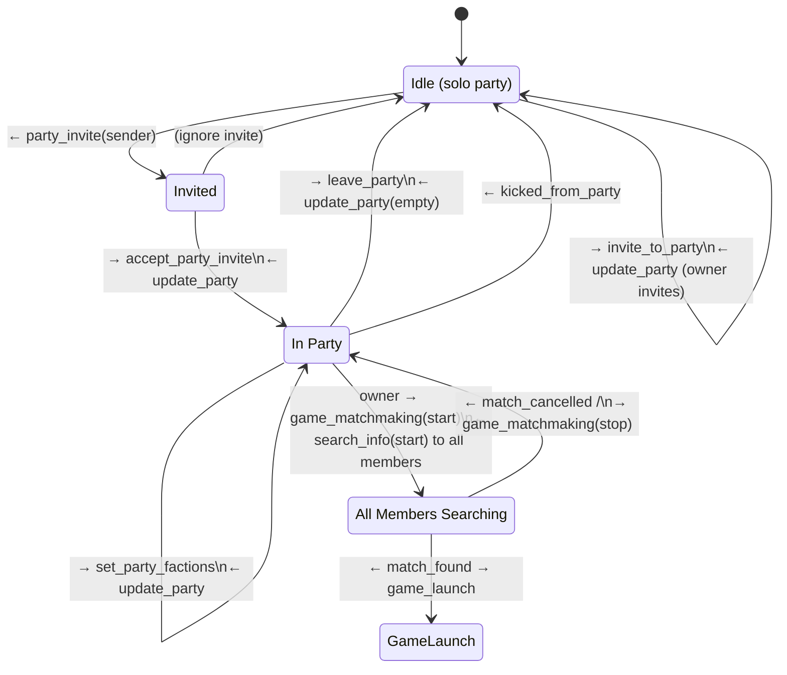

# Client Lifecycle State Machine

This diagram documents the player/client lifecycle from the **server's perspective**, showing how lobby messages drive state transitions. States correspond to the `PlayerState` enum tracked server-side, extended with connection phases.

For the full message schema, see [v1/asyncapi.yml](v1/asyncapi.yml).

## State Machine

## Party Flow (overlay on Idle state)

Party interactions happen while the player is in the **Idle** state. The party is a grouping mechanism — it does not change `PlayerState` directly, but the party owner queues all members together when starting matchmaking.

## State Reference

| PlayerState | Description | Entry Trigger |
|---|---|---|
| `IDLE` | In lobby, no active game/search | Login, game end, search cancel |
| `SEARCHING_LADDER` | Queued for matchmaking | `game_matchmaking(start)` |
| `STARTING_AUTOMATCH` | Match found, awaiting game setup | `match_found` from server |
| `STARTING_GAME` | Game launch sent, awaiting FA process | `game_launch` from server |
| `HOSTING` | Host in game lobby (FA running) | `GameState("Idle")` as host |
| `JOINING` | Guest connecting to host | `GameState("Idle")` as guest |
| `PLAYING` | Game simulation running | `GameState("Launching")` / `game.launch()` |

## Message Legend

| Arrow | Meaning |
|---|---|
| `→ message` | Client sends to server |
| `← message` | Server sends to client |
| `→ GameState(X)` | Game client sends GPGNet command (target: game) |
| `← HostGame / JoinGame / ConnectToPeer` | Server sends GPGNet command to game client |
